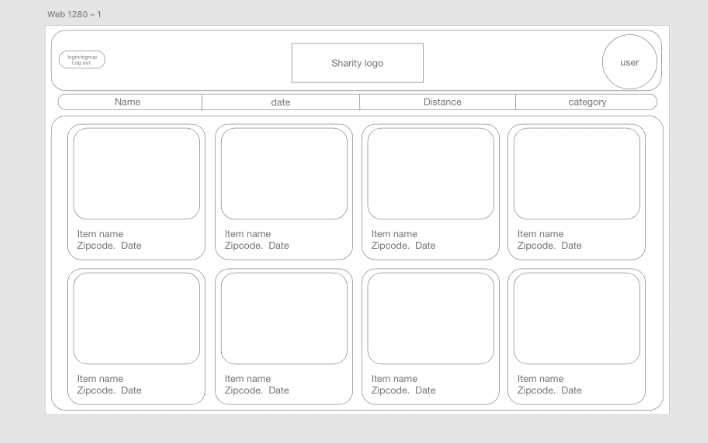
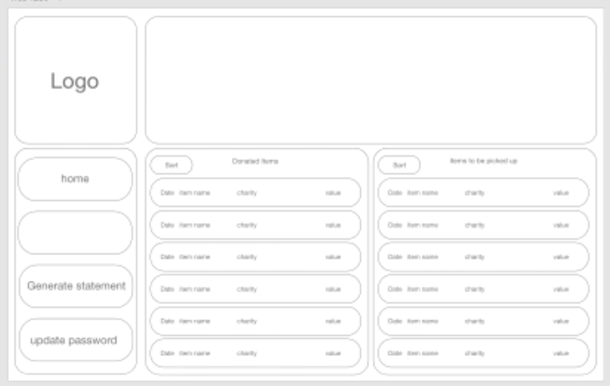
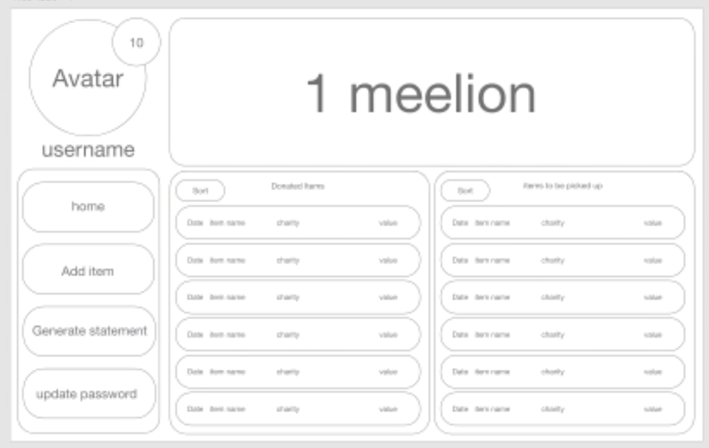
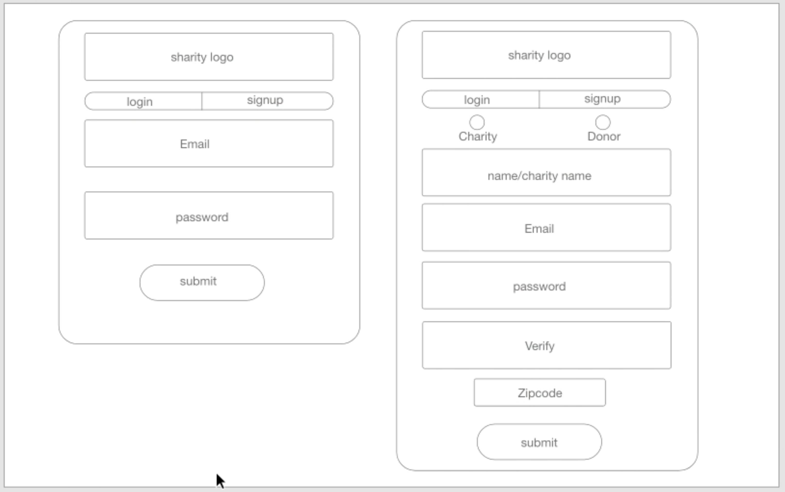
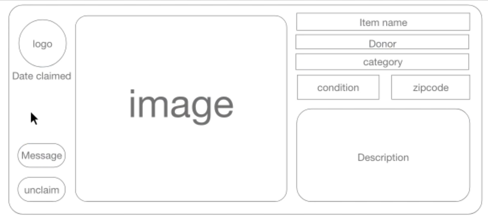

_________________________
# Welcome To Sharity
Sharity is a Online, Donor to Charity, Web Application that allows for individuals to sign up and donate their unwanted items for Charities to then claim. Our team of Full Stack Software Engineers was approached by a client who asked us to build the Sharity web application. We were given feedback throughout and a little over a week to develop and deploy the application. 

Below you will find our User Stories, Dev Team, Tech Stack, Installation Guidance, and Wire Frames.

This Application was built by a team of 8 Full Stack Software Engineers from the Hack Reactor, Austin, 49th Cohort. (HRATX49)
_________________________
VIDEO DEMO

_________________________
# User Stories

* As a Donor/Charity, I want to be able to Create an Account
* As a Donor, I want to be able to put an Item up for donation 
* As a Charity, I want to be able to claim an Item that was put up for donation 
* As a Donor, I want to be able to delete an Item that was put up for donation 
* As a Charity, I want to be able to sort through unclaimed donations based on Name, Location, Date, & Category 
* As a Charity, I want to be able to generate a statement of my Donations 
* As a Donor, I want to be able to generate a statement for tax purposes
* As a Donor, I want to see all of my claimed, but not yet picked up donations
* As a Donor, I want to see a history of all of my donations
* As a Donor/Charity, I want to be able to establish communication with my counter part 
* As a Donor, I want to see the total value of items I have donated
* As a Charity, I want to be able to confirm when a donation was picked up 
* As a Charity, I want to be able to see the total amount and value of items claimed 
_______________________

# Yet to Come
* As a Donor/Charity, I want to be able to chat on the site 
* As a Donor, I want to be able to claim a donation
* As a Donor, I want to be able to confirm a donation was picked up
* As a Donor, I want to be able to select whether or not an individual can claim my donation
_______________________
# The Dev Team

  - [Benjamin Polancich] - Project Manager, Front End Focus, Landing Page
  - [Anthony Casper] - Architect Lead, Back End Focus, Chat, Login & Sign Up, About Us
  - [Jonathan Zurita] - UX Design Lead, Front End Focus, User Profile Page
  - [Denee Lopez] - Back End Focus, User Profile Page
  - [Ricardo Guerrero] - Back End Focus, Landing Page
  - [Christopher Murray] - Back End Focus, Charity Page
  - [Joshua Edwards] - Front End Focus, Charity Page
  - [Kenneth 'Peyton' Perret] - Front End Focus, Chat, Login & Sign Up

_______________________
# Tech Stack
Sharity uses a number of open source projects to work properly:

##### Front End
* [React] - A JavaScript library for building user interfaces
* [React Router] - Declarative Routing for React
##### Back End
* [node.js] - Node.js is a JavaScript runtime built on Chrome's V8 JavaScript engine.
* [Express] - fast node.js network app framework
* [MongoDB] - A noSQL database for modern apps. Easily organize, use, and enrich data — in real time, anywhere
##### Testing And Deployment
* [AWS] - Amazon Web Services offers reliable, scalable, and inexpensive cloud computing services.
* [Google Cloud] - Meet your business challenges head on with cloud computing services from Google.
##### Developer Tools
* [WebPack] - Webpack is a module bundler. Its main purpose is to bundle JavaScript files for usage in a browser.
* [Babel] - The compiler for next generation JavaScript
* [NPM] - An all in one package manager.
##### API
* [Axios] - Promise based HTTP client for the browser and node.js 

_______________________
### Installation
Install the dependencies and devDependencies and start the server.

```sh
$ cd HRATX49-Sharity
$ npm run setup
$ npm run start
Go to localhost:5000/
```
_______________________
# Wire Frames

 
 
 
 
 


[//]: # (These are reference links used in the body of this note and get stripped out when the markdown processor does its job. There is no need to format nicely because it shouldn't be seen. Thanks SO - http://stackoverflow.com/questions/4823468/store-comments-in-markdown-syntax)


   [Benjamin Polancich]: <https://github.com/PolancichBen>
   [Anthony Casper]: <https://github.com/a-casper>
   [Jonathan Zurita]: <https://github.com/JonathanZurita>
   [Denee Lopez]: <https://github.com/deneelopez>
   [Ricardo Guerrero]: <https://github.com/richigro>
   [Christopher Murray]: <https://github.com/cmurray1105>
   [Joshua Edwards]: <https://github.com/Kptkrunch>
   [Kenneth 'Peyton' Perret]: <https://github.com/kperre94>
   [node.js]: <http://nodejs.org>
   [express]: <http://expressjs.com>
   [React]: <https://reactjs.org/>
   [React Router]: <https://reactrouter.com/>
   [MongoDb]: <https://www.mongodb.com/>
   [AWS]: <https://aws.amazon.com/>
   [Google Cloud]: <https://cloud.google.com/>
   [WebPack]: <https://webpack.js.org/>
   [Babel]: <https://babeljs.io/>
   [NPM]: <https://www.npmjs.com/>
   [Axios]: <https://github.com/axios/axios>
